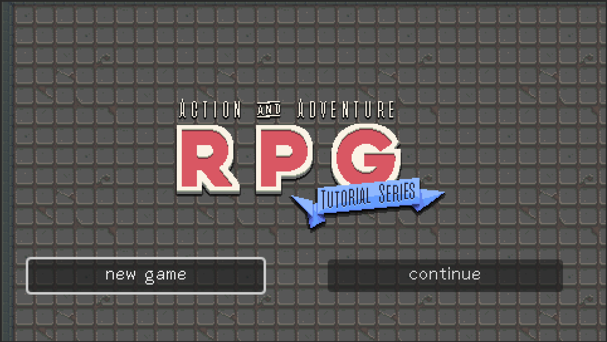
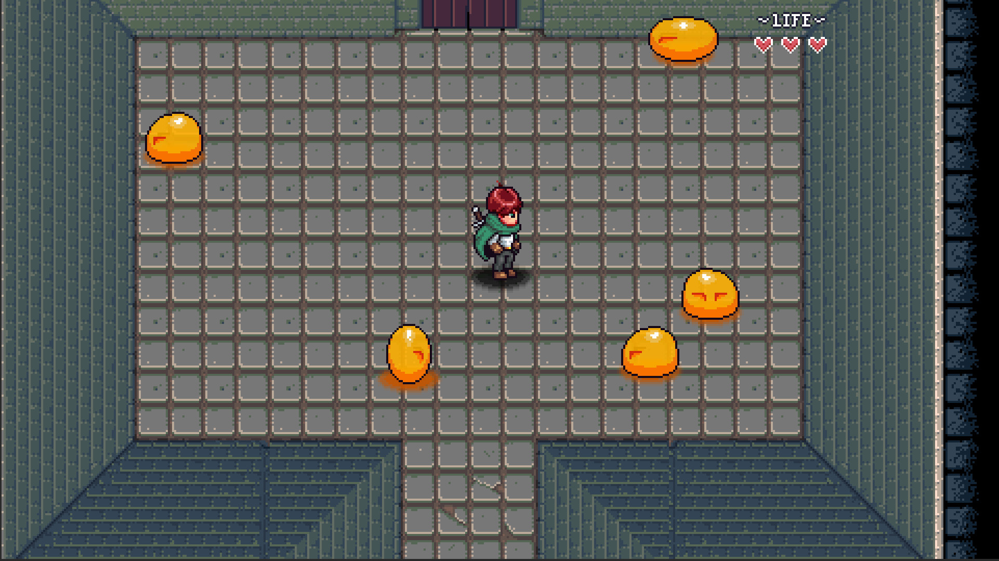
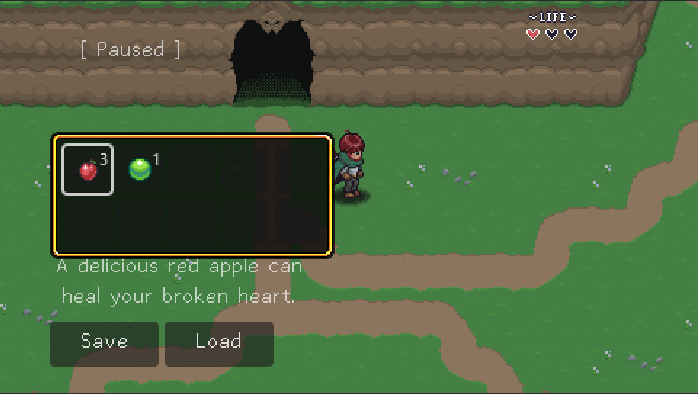

# 基于 Godot 的 2D 像素 AARPG 原型

## 项目简介

这是一个基于 Godot 开发的 2D 像素 ARPG 原型项目，也是我个人从 0 到 1 完成的游戏开发 Demo。项目围绕「探索 - 战斗 - 收集 - 保存 - 继续」的基础游戏循环展开，包含角色控制、敌人追击、战斗判定、道具拾取、背包 UI、NPC 交互与存档读取等核心功能。

本项目主要用于验证我在 2D 游戏客户端开发、玩法系统拆分、状态管理、事件通信、碰撞判定与数据持久化方面的实践能力。

---

## 操作说明

| 操作        | 按键          |
| ----------- | ------------- |
| 移动        | W / A / S / D |
| 攻击        | J             |
| 交互        | K             |
| 技能        | L             |
| 与 NPC 对话 | P             |

## 运行方式

1. 打开本仓库的 Release 页面。
2. 下载最新版本压缩包。
3. 解压后运行 `.exe` 文件。

## 项目展示

### Demo 视频

- [Demo 视频链接](https://www.bilibili.com/video/BV1F5dFBuEzT/?spm_id_from=333.1387.homepage.video_card.click&vd_source=9a3cfeb9320e3b6531d661c829fa0c79)

### 游戏截图

## License

本项目为个人学习实践项目，仅用于学习和交流。
